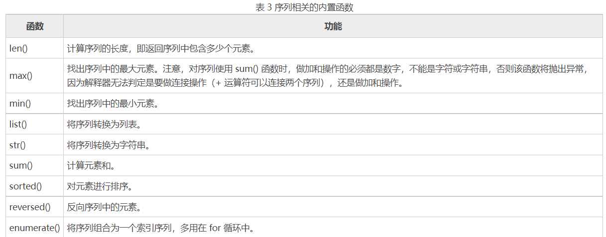

## python中的序列

### 序列是 字符串，元组，列表的统称有一下特点
- 都可以通过索引得到每一个元 
- 默认索引值总是从零开 
- 可以通过切片的方法得到一个范围内的元素的集 
- 有很多共同的操作符(重复操作符、拼接操作符、成员关系操作符)

### 序列操作

1). 序列索引
- python的序列中，每个元素都有自己的索引下标，从0开始依次递增，python中支持索引为负数表示为从序列的末尾(-1)开始，

2). 序列切片
- 序列切片是访问序列的另一种方法，它可以访问一定范围内的元素，通过切片操作可以生成一个新的序列(可用来copy序列)

- 语法格式：```sname[start : end : step]```
    1. start: 开始的索引
    2. end: 结束的索引
    3. step: 递增的步长

3). 序列相加
- 在python中 支持两种类型相同的序列使用“+”运算符做相加操作，它会将两个序列进行连接，但不会去除重复的元素（这里的类型相同指的是，同为列表类型或者同为元组类型亦或字符串类型）

4). 序列相乘
- 在python中 使用数字 n 乘以一个序列会生成新的序列，其内容为原来序列被重复 n 次的结果

- 比较特殊的是，列表类型在进行乘法运算时，还可以实现初始化指定长度列表的功能 
    ``` list = [number] * 3 结果为 [number, number, number] ```

5). 检查元素是否包含在序列中

- 检查元素是否为某序列的成员，语法格式为：``` value in sequence ```

- 例如：``` 'h' in " hello " ```

- not in 表示判断是否不包含


6). 和序列相关的内置函数




#### python中的列表像java数组一样的（list）

列表的操作和数组类似，不过python没有数据类型，所以python中的列表可以存储任意类型的数据

- 通过``` list = [1, 1, 2, 3, 5, 8]```创建一个列表
- 通过``` list[0] ``` 访问列表中的第一个元素

#### 列表中提供的方法


- append(): 在列表的后面在追加一个元素，只能是一个元素

- count(): 返回列表中的元素个数

- index(index): 在指定位置插入一个元素，该位置的元素后移

- reverse(): 列表中的所有元素顺序反转

- clear(): 清空列表中的元素

- extend(list): 通过另一个列表对该列表进行扩展，追加到列表最后面

- pop(index): 类似于栈，*** 弹出 ***指定索引位置的元素，没有参数时，默认最后一个元素

- sort(): 对列表中的数字元素进行排序(前提是列表中的元素全是数字)

- copy(list): 从参数中的列表拷贝出来一份

- index(value): 返回value在列表中的索引

- remove(value): 删除列表中的指定值

### python中的元组（tuple）

元组创建之后，就不能再进行修改！
元组相当于不可分割的最小单位。
- 通过``` tuple = (1,[ 1, 2, 3, 5]) ``` 创建一个元组

#### 元组仅提供了两个方法供使用
- count():返回元组中元素的个数
- index(value):返回value在元组中的下标，不存在会报错

## python中序列的切片操作

#### 对于python中的列表、元组统称为序列，序列就是可迭代的对象

切片操作的语法格式：``` list[a:b] ```对list序列进行切片范围是[a,b)左闭右开，其中可以a,b都可以省略，``` list[a : ], list[ : b], list[ : ] ```

